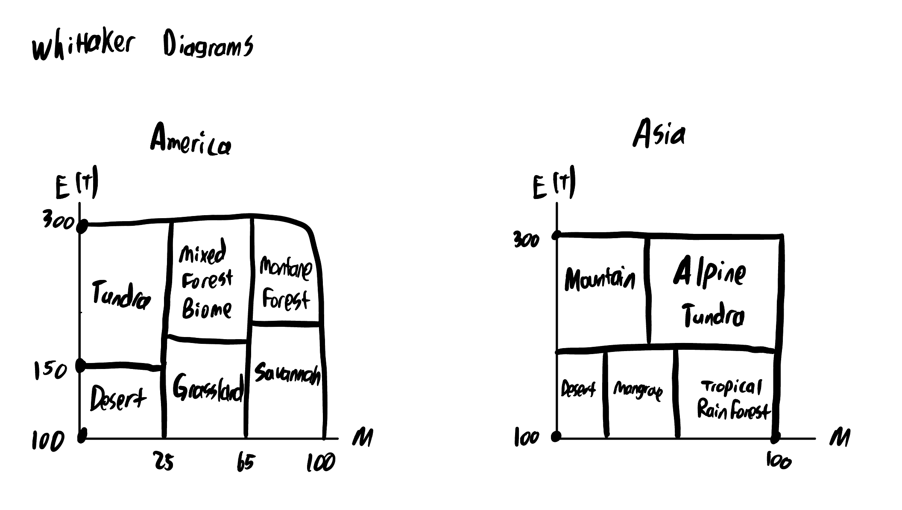

# Island Generator

This is an island generator that works on already created meshes.

## Command Line Args
| shortOption | longOption | Args? | Arg value | Desc | Required |
|:--:|---------------|------|-------|-----|--------|
| o | output | x | .mesh file | Specify the output mesh file | x |
| i | input | x | .mesh file | Specify the input mesh file | x |
| shape | shape | x | String | Select the type of shape the island should be (circle, triangle, oval, square, threecircle) |  |
| altitude | altitude | x | String | Selects the altitude profile for the island (crater, mountain, prairie) |  |
| aquifer | aquifer | x | Integer | Specify the number of aquifers  |  |
| lake | lake | x | Integer | Specify the number of lakes  |  |
| river | river | x | Integer | Specify the number of rivers  |  |
| soil | soil | x | String | Selects the soil profile for the island (Dry, Wet) |  |
| cities | cities | x | Integer | Selects the number of cities for the island |  |
| network | network | x | String | Selects the type of network for the cities(star, non-star) |  |
| biomes | biomes | x | String | Selects the whittaker diagram for the island (america, asia) |  |
| visual | visual | x | String | Selects the visual mode for the island (altitude, biome, debug, lagoon, moisture) |  |

## Whittaker Diagrams 

Here is how we distributed biomes for our Whittaker Diagrams:
